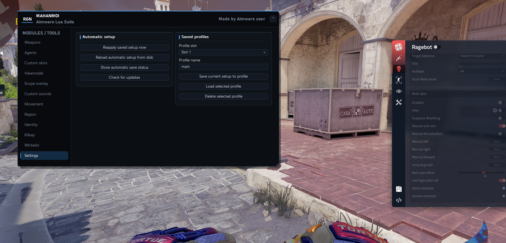

  

<h1 align="center">rgnMultitool</h1>

  <strong>Source-visible Aimware Lua toolkit for CS2.</strong> 
  Every module lives in one compact menu and optional gameplay modules start disabled.

  
  
  
  

## Download

[**Download `loader.lua`**](https://raw.githubusercontent.com/ragnarokcs/rgnMultitool/main/loader.lua)

`loader.lua` is the primary and recommended entry point. It validates and runs the current public source, keeps a last-known-good offline cache and downloads the full Lua again only when `version.txt` changes. `rgnMultitool.lua` remains available for source review and development; regular users do not need to install it manually.

## Interface preview

Click any preview to open the full-size image.

<table>
  <tr>
    <td width="50%" valign="top">
      
      
<strong>Weapons</strong> Browse weapons, knives and gloves, select finishes, tune wear and seed, and save the setup.

    </td>
    <td width="50%" valign="top">
      
      
<strong>Agents</strong> Select and persist official Terrorist and Counter-Terrorist agents.

    </td>
  </tr>
  <tr>
    <td width="50%" valign="top">
      
      
<strong>Custom Skins</strong> Discover compatible character models from the local <code>csgo/characters</code> directory.

    </td>
    <td width="50%" valign="top">
      
      
<strong>Viewmodel</strong> Adjust X, Y and Z positioning, apply presets and optionally keep the knife in the left hand.

    </td>
  </tr>
  <tr>
    <td width="50%" valign="top">
      
      
<strong>Scope Overlay</strong> Use the lightweight luminous sniper overlay with a configurable color and separated center point.

    </td>
    <td width="50%" valign="top">
      
      
<strong>Custom Sounds</strong> Choose local hit and kill sounds, preview them and control each volume independently.

    </td>
  </tr>
  <tr>
    <td width="50%" valign="top">
      
      
<strong>Movement</strong> Optional velocity display, jump trail, edge-bug helper and W/A/S/D null-bind resolver.

    </td>
    <td width="50%" valign="top">
      
      
<strong>Identity</strong> Configure custom player-name and clan-prefix behavior independently.

    </td>
  </tr>
  <tr>
    <td width="50%" valign="top">
      
      
<strong>Killsay</strong> Select a language pack, message order, interval and optional victim-name template.

    </td>
    <td width="50%" valign="top">
      
      
<strong>Configs</strong> Reapply the automatic setup, manage named profiles and check for validated updates.

    </td>
  </tr>
</table>

## Features

### Cosmetics

- Weapon finishes for the complete supported weapon catalogue, including modern and legacy paint flows.
- Knife models and finishes with automatic reapplication after spawn, death, team changes and map changes.
- Glove models and finishes with guarded refresh timing to prevent flicker and repeated writes.
- Official agents with saved selection.
- Custom character models discovered from the local `csgo/characters` directory.
- Automatic cosmetic persistence plus five named weapon, knife and glove profiles.

### Viewmodel and movement

- Safe extended X, Y and Z viewmodel positioning with presets.
- Optional automatic left-hand knife, routed through the main command hook, with right-hand restoration for other weapons.
- Velocity display and configurable jump trail.
- Prediction edge-bug helper with hold/toggle activation.
- W/A/S/D null-bind resolver.
- Movement features are opt-in and disabled by default.

### Manual AA, region and whitelist

- Manual AA directions are available through Aimware's native **Ragebot > Anti-Aim** controls, with optional compact on-screen direction indicators.
- The **Region** module reads CS2's public Steam relay latency data, orders recognized relays from lowest to highest measured latency and uses a green-to-yellow-to-red latency range.
- Select one or more relays and apply the preference; when multiple relays are selected, the lowest measured latency is used for the official relay preference.
- The **Whitelist** module refreshes the active enemy roster on joins, spawns and team changes. Enemies begin as valid targets; selected players can be protected locally from targeting, with the target state applied immediately after every UI change.

### Scope overlay

- Optional Neverlose-inspired sniper overlay with pointed arms, a separated luminous center dot and configurable color.
- Six supersampled fog/bloom layers are cached as one texture and rendered in one operation per frame.
- Replaces Aimware's native full-screen NoScope lines while active and restores the user's original NoScope settings when disabled or unloaded.
- Scope detection is cached at 20 Hz; the module is disabled by default.

### Identity and Killsay

- Custom player name and clan prefix controls, independently enabled and saved.
- Killsay with multilingual message packs, random/sequential order, custom templates and optional victim names.
- Identity and Killsay features are opt-in and disabled by default.

### Custom sounds

- Independent custom hit and kill sounds with volume controls and preview buttons.
- Strict local-attacker resolution prevents hits and kills by teammates or opponents from playing sounds, including in Deathmatch.
- Local respawns, team changes and controlled bots are resolved through the current pawn/controller identity cache.
- Place compiled `.vsnd_c` files in `Counter-Strike Global Offensive/game/csgo/sounds` or its subfolders, then press **Refresh csgo/sounds**.
- Sound scanning occurs only at Lua startup or on manual refresh; both effects are disabled by default.
- The Lua never downloads or installs asset packs automatically. See [Manual asset packages](PACKAGES.md) for the optional sound and custom-character downloads.

### Vote information

- Always-on vote revealer with fully English, team-colored local chat messages and no separate HUD overlay.
- Reliable allied and enemy initiator, voter and kick-target names resolved from the exact zero-based vote slot and bidirectionally between controllers and pawns.
- Version 1.1.11 retains the one-time Killsay and vote event bridges; session transitions renew listeners and state without mutating Aimware's native callback registry.
- The release keeps the proven per-file configuration and cache layout from 1.1.0; it does not use the reverted unified-storage experiment.

### Reliability

- Event-driven cosmetic engine with sparse maintenance work for reduced frame-time impact.
- Disabled Killsay, Custom Sounds, Movement, Scope Overlay, left-hand knife and Identity paths now short-circuit before protected callbacks, entity work or session polling.
- Killsay no longer writes diagnostic files for unrelated server deaths; runtime files are reserved for state transitions, send failures and actionable diagnostics.
- Vote logic preserves its 20 Hz service cadence while avoiding protected-call overhead on intermediate `CreateMove` commands.
- Runtime overlay dispatch is allocated once at startup instead of creating a temporary closure every rendered frame.
- Automatic session rearming when joining another server or changing maps.
- Region probing is bounded and low-frequency; latency refreshes happen at load, on explicit reload and while Steam is still preparing relay samples, never every frame.
- Local configuration files only; no user-specific Windows paths are embedded.
- Built-in update check with source-size, signature, version and Lua syntax validation.

The distributed `loader.lua` checks the small `version.txt` manifest on startup. It downloads the full source only when the published version changes, validates the release signature and Lua syntax, then keeps a local offline cache. Updates are never hot-loaded while a match is running; use **CONFIGS > Check for updates**, then run the Lua again.

## Installation

1. Download only [`loader.lua`](https://raw.githubusercontent.com/ragnarokcs/rgnMultitool/main/loader.lua) and place it in Aimware's Lua scripts folder.
2. In Aimware Lua permissions, allow internet connections and editing Lua files.
3. Run `loader.lua`.
4. Keep only one rgnMultitool loader/source active at a time.

Keep `loader.lua` as the only rgnMultitool script configured for autorun. The loader and full source use relative data filenames and contain no Windows username or PC-specific installation path.

## Update safety

Before replacing its cache, the loader verifies:

- the response is large enough to be a complete release;
- the fixed `RGN_MULTITOOL_SOURCE_V1` signature is present;
- the source version matches the manifest;
- `loadstring` can compile the complete source.

If GitHub is unavailable, the last validated cache is used. The source is intentionally published in full so users can inspect it before running it.

## Credits

Created and owned by **ragnarokcs**. The project was developed with API and implementation references from the Aimware Lua documentation, `cachorropacoca/aw_cs2v6_femboytap`, `mahanneo/SkinChanger_aw_v6`, public Aimware Lua examples and community research. See `NOTICE.md`.

## Disclaimer

This is an unofficial community project and is not affiliated with Valve or Aimware. Use only where permitted and at your own risk.
